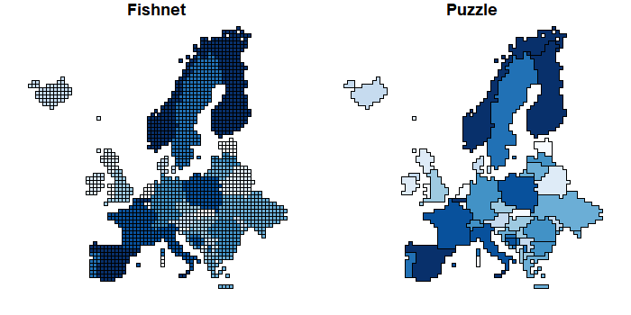
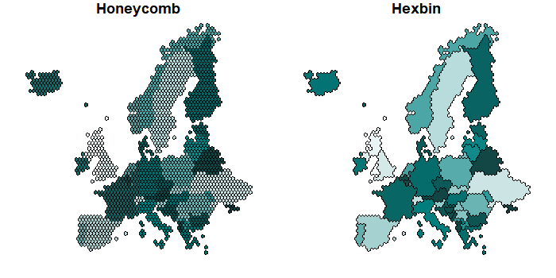

Beautiful Maps with R (I): Fishnets. Honeycombs and Pixels
================
2019-05-30

Sometimes you want to produce maps with special layouts. I specially
like maps with modified geometries, e.g. simplifiying the original
shapes to squares or dots. When doing a little search over the web I
found the fantastic post [Fishnets and Honeycomb: Square vs. Hexagonal
Spatial Grids](http://strimas.com/spatial/hexagonal-grids/) by [Matt
Strimas-Mackey](http://strimas.com/about/) that was a huge inspiration
(by the way, don’t miss [his blog](http://strimas.com/#posts), full of
very interesting pieces of work).

The only thing I was not completely comfortable with was that the post
used the
[old-fashioned](https://geocompr.robinlovelace.net/intro.html#the-history-of-r-spatial)
`sp` package instead of my personal fav, the `sf` package, (the post was
published in 2016, note that author has also moved to the `sf` package
since then). So I decided to explore further options with `sf`.

The approach is similar (using grids over a map and work with that) but
using
[`st_make_grid`](https://www.rdocumentation.org/packages/sf/versions/0.7-4/topics/st_make_grid).
I also expanded it by grouping the grids and also producing dots over
the geometries. So basically I produced 5 variations of the map:

| Type          | Replacement | Grouped |
| ------------- | :---------: | ------: |
| **Fishnet**   |   Square    |      No |
| **Puzzle**    |   Square    |     Yes |
| **Honeycomb** |   Hexagon   |      No |
| **Hexbin**    |   Hexagon   |     Yes |
| **Pixel**     |     Dot     |      No |

## Required R packages

``` r
library(sf)
library(rnaturalearth)
library(dplyr)
library(RColorBrewer)
```

### Working with square grids

Let’s use the `square` option of `st_make_grid` and play a bit with it.

``` r
europe <- ne_download(50,
  type = "map_subunits",
  returnclass = "sf",
  destdir = tempdir()
) %>%
  subset(CONTINENT == "Europe") %>%
  subset(!NAME_EN %in% c("Jan Mayen", "Svalbard", "Russia"))
# Excluding for plotting purposes only

# Projecting and cleaning
europe <- st_transform(europe, 3857) %>% select(NAME_EN, ADM0_A3)
initial <- europe
initial$index_target <- 1:nrow(initial)
target <- st_geometry(initial)

# Create my own color palette

mypal <- colorRampPalette(c("#F3F8F8", "#008080", "#15403F"))
```

{: .box-warning} <i class="fa fa-exclamation-triangle"></i> **Warning:**
The `cellsize` should be established in the same unit that the
projection (in this case is meters). Pay special attention on this,
given that if the parameter is too small (meaning that the grid is too
dense) **R** could crash easily.

``` r
grid <- st_make_grid(
  target,
  100 * 1000, # Kms
  crs = st_crs(initial),
  what = "polygons",
  square = TRUE
)
# Make sf
grid <- st_sf(index = 1:length(lengths(grid)), grid) # Add index

# We identify the grids that belongs to a entity by assessing the centroid
cent_grid <- st_centroid(grid)
cent_merge <- st_join(cent_grid, initial["index_target"], left = F)
grid_new <- inner_join(grid, st_drop_geometry(cent_merge))


# Fishnet
Fishgeom <- aggregate(
  grid_new,
  by = list(grid_new$index_target),
  FUN = min,
  do_union = FALSE
)

# Lets add the df
Fishnet <- left_join(
  Fishgeom %>%
    select(index_target),
  st_drop_geometry(initial)
) %>%
  select(-index_target)

# Now lets create the Puzzle

Puzzlegeom <- aggregate(
  grid_new,
  by = list(grid_new$index_target),
  FUN = min,
  do_union = TRUE # This is the only piece that changes!!!
)

Puzzle <- left_join(
  Puzzlegeom %>%
    select(index_target),
  st_drop_geometry(initial)
) %>%
  select(-index_target)


par(mfrow = c(1, 2), mar = c(1, 1, 1, 1))
plot(st_geometry(Fishnet), col = mypal(nrow(Fishnet)), main = "Fishnet")
plot(st_geometry(Puzzle), col = mypal(nrow(Fishnet)), main = "Puzzle")
```



### Going hex

Extremely easy. We just need to change the `square` parameter of
`st_make_grid` from `TRUE` to `FALSE`

``` r
grid <- st_make_grid(
  target,
  100 * 1000, # Kms
  crs = st_crs(initial),
  what = "polygons",
  square = FALSE
)
# Make sf
grid <- st_sf(index = 1:length(lengths(grid)), grid) # Add index

# We identify the grids that belongs to a entity by assessing the centroid
cent_grid <- st_centroid(grid)
cent_merge <- st_join(cent_grid, initial["index_target"], left = F)
grid_new <- inner_join(grid, st_drop_geometry(cent_merge))

# Honeycomb
Honeygeom <- aggregate(
  grid_new,
  by = list(grid_new$index_target),
  FUN = min,
  do_union = FALSE
)

# Lets add the df
Honeycomb <- left_join(
  Honeygeom %>%
    select(index_target),
  st_drop_geometry(initial)
) %>%
  select(-index_target)

# Now lets create the Hexbin

Hexbingeom <- aggregate(
  grid_new,
  by = list(grid_new$index_target),
  FUN = min,
  do_union = TRUE # This is the only piece that changes!!!
)

Hexbin <- left_join(
  Hexbingeom %>%
    select(index_target),
  st_drop_geometry(initial)
) %>%
  select(-index_target)


par(mfrow = c(1, 2), mar = c(1, 1, 1, 1))
plot(st_geometry(Honeycomb), col = mypal(nrow(Honeycomb)), main = "Honeycomb")
plot(st_geometry(Hexbin), col = mypal(nrow(Honeycomb)), main = "Hexbin")
```


