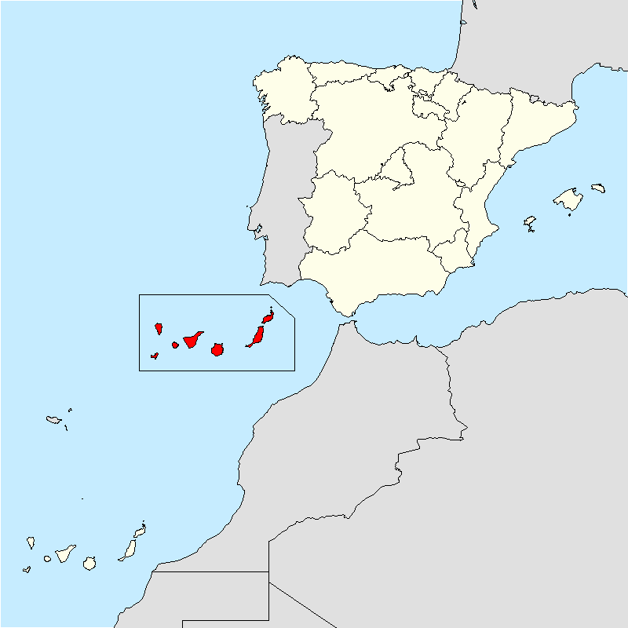
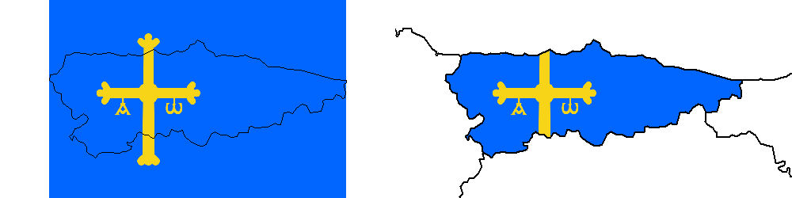
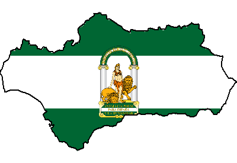
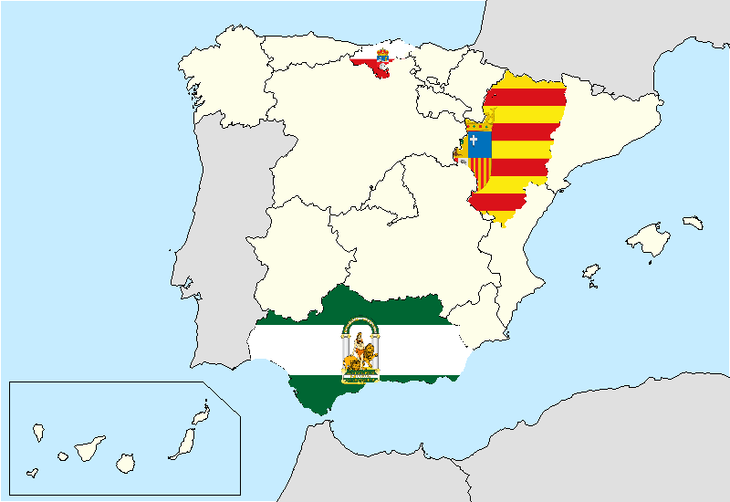

Beautiful Maps with R (II): Fun with flags
================
2019-06-20

Want to plot a flag (or any .png file) as a background of a map? You are
in the right place.

### Required R packages

``` r
library(png)
library(curl)
library(raster)
library(sf)
library(dplyr)
```

### Working with square grids

``` r
SPAIN <- st_read(
  "https://ec.europa.eu/eurostat/cache/GISCO/distribution/v2/nuts/geojson/NUTS_RG_03M_2016_3857_LEVL_2.geojson",
  stringsAsFactors = FALSE
) %>%
  subset(CNTR_CODE == "ES")

WORLD <- st_read(
  "https://ec.europa.eu/eurostat/cache/GISCO/distribution/v2/countries/geojson/CNTR_RG_03M_2016_3857.geojson",
  stringsAsFactors = FALSE
)
# Plot
plot.new()
par(mar = c(0, 0, 0, 0))
plot(st_geometry(SPAIN),
  col = NA,
  border = NA,
  bg = "#C6ECFF"
)
plot(st_geometry(WORLD),
  col = "#E0E0E0",
  bg = "#C6ECFF",
  add = T
)
plot(st_geometry(SPAIN), col = "#FEFEE9", add = T)

# Move Canary Islands
CAN <- SPAIN %>% subset(NUTS_ID == "ES70")
CANNEW <- st_sf(st_drop_geometry(CAN),
  geometry = st_geometry(CAN) + c(550000, 920000)
)
st_crs(CANNEW) <- st_crs(SPAIN)

# BBoxCan
bboxcan <- CANNEW %>% st_bbox()
coords <- cbind(
  bboxcan[1] - 50000,
  bboxcan[4] + 50000
)
coords <- rbind(
  coords,
  cbind(
    bboxcan[1] - 50000,
    bboxcan[2] - 50000
  )
)
coords <- rbind(
  coords,
  cbind(
    bboxcan[3] + 90000,
    bboxcan[2] - 50000
  )
)
coords <- rbind(
  coords,
  cbind(
    (bboxcan[3] - 20000),
    bboxcan[4] + 50000
  )
)
coords <- rbind(
  coords,
  cbind(
    (bboxcan[3] + 90000),
    bboxcan[4] - 50000
  )
)
bboxcan <- st_multipoint(coords) %>%
  st_sfc(crs = st_crs(CANNEW)) %>%
  st_convex_hull()

# Plot-add
plot(st_geometry(CANNEW), add = T, col = "red")
plot(st_geometry(bboxcan), add = T)
```



``` r
SPAINV2 <- rbind(
  SPAIN %>%
    subset(NUTS_ID != "ES70"),
  CANNEW
)

shp <- SPAINV2 %>% subset(id == "ES12")
# Get file
url <- "https://upload.wikimedia.org/wikipedia/commons/thumb/3/3e/Flag_of_Asturias.svg/800px-Flag_of_Asturias.svg.png"
dirfile <- paste(tempdir(), "flag.png", sep = "/")
curl_download(url, dirfile)
flag <- brick(readPNG(dirfile) * 255)
# Geotagging the raster
# Adding proj4string
projection(flag) <- CRS(st_crs(shp)[["proj4string"]])
# Now cover with the flag the whole extent of the shape
ratioflag <- dim(flag)[2] / dim(flag)[1]

# Middle point
extshp <- extent(shp)
w <- (extshp@xmax - extshp@xmin) / 2
h <- (extshp@ymax - extshp@ymin) / 2
w_mp <- extshp@xmin + w
h_mp <- extshp@ymin + h
# Depending of the shape the fitting could be in height or width
if (w > h * ratioflag) {
  new_ext <- c(
    extshp@xmin,
    extshp@xmax,
    h_mp - w / ratioflag,
    h_mp + w / ratioflag
  )
} else {
  new_ext <- c(
    w_mp - h * ratioflag,
    w_mp + h * ratioflag,
    extshp@ymin,
    extshp@ymax
  )
}
extent(flag) <- new_ext
par(mar = c(1, 1, 1, 1), mfrow = c(1, 2))
plotRGB(flag)
plot(st_geometry(shp), add = T, lwd = 1.2)

# Mask
fig <- mask(flag, shp)
plotRGB(fig, bgalpha = 0)
plot(st_geometry(SPAINV2), add = T, lwd = 2)
```



``` r
stdh_png2map <- function(sf, png) {
  shp <- sf
  if (file.exists(png)) {
    flag <- brick(readPNG(png) * 255)
  } else {
    dirfile <- paste(tempdir(), "flag.png", sep = "/")
    curl_download(png, dirfile)
    flag <- brick(readPNG(dirfile) * 255)
  }
  # Geotagging the raster
  # Adding proj4string
  projection(flag) <- CRS(st_crs(shp)[["proj4string"]])
  # Now cover with the flag the whole extent of the shape
  ratioflag <- dim(flag)[2] / dim(flag)[1]

  # Middle point
  extshp <- extent(shp)
  w <- (extshp@xmax - extshp@xmin) / 2
  h <- (extshp@ymax - extshp@ymin) / 2
  w_mp <- extshp@xmin + w
  h_mp <- extshp@ymin + h
  # Depending of the shape the fitting could be in height or width
  if (w > h * ratioflag) {
    new_ext <- c(
      extshp@xmin,
      extshp@xmax,
      h_mp - w / ratioflag,
      h_mp + w / ratioflag
    )
  } else {
    new_ext <- c(
      w_mp - h * ratioflag,
      w_mp + h * ratioflag,
      extshp@ymin,
      extshp@ymax
    )
  }
  extent(flag) <- new_ext
  # Mask
  fig <- mask(flag, shp)
  return(fig)
}
# Run it
AND <- stdh_png2map(
  SPAINV2 %>% subset(id == "ES61"),
  "https://upload.wikimedia.org/wikipedia/commons/thumb/2/20/Flag_of_Andaluc%C3%ADa.svg/800px-Flag_of_Andaluc%C3%ADa.svg.png"
)
# Plot it
par(mar = c(0, 0, 0, 0), mfrow = c(1, 1))
plotRGB(AND)
plot(SPAINV2 %>% subset(id == "ES61") %>% st_geometry(),
  add = T, lwd = 2
)
```



``` r
par(mar = c(0, 0, 0, 0))
plot(SPAINV2 %>%
  st_geometry(),
col = NA,
border = NA,
bg = "#C6ECFF"
)
plot(st_geometry(WORLD),
  col = "#E0E0E0",
  add = T
)
plot(st_geometry(SPAINV2),
  col = "#FEFEE9",
  add = T
)
plot(st_geometry(bboxcan),
  add = T
)

# Andalucia
plotRGB(AND, add = T, bgalpha = 0)

# Aragon
plotRGB(
  stdh_png2map(
    subset(SPAINV2, id == "ES24"),
    "https://upload.wikimedia.org/wikipedia/commons/thumb/1/18/Flag_of_Aragon.svg/800px-Flag_of_Aragon.svg.png"
  ),
  bgalpha = 0,
  add = T
)
# Code hidden for the rest of autonomous communities
```


