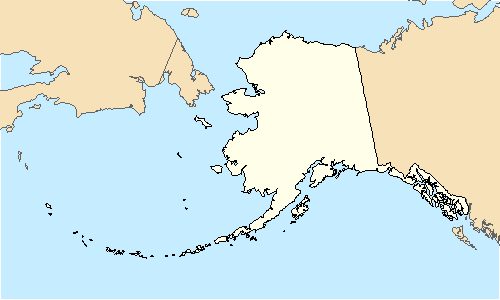

Quick R: Inset maps
================
2019-11-08

How to place an inset map in **R**? There are many solutions out there
using the `ggplot2`package (see [Drawing beautiful maps programmatically
with R, sf and
ggplot2](https://www.r-spatial.org/r/2018/10/25/ggplot2-sf-3.html) by
Mel Moreno and Mathieu Basille). However, I like the old reliable
`plot`function, so the question is: is therre another way?

There is. I found inspiration
[here](https://www.statmethods.net/advgraphs/layout.html) and I just
applied it to a map.

### Required R packages

``` r
library(sf)
library(dplyr)
library(rnaturalearth)
```

### Mimicking Moreno & Basille

I would present here an alternative version of [Drawing beautiful maps
programmatically with R, sf and
ggplot2](https://www.r-spatial.org/r/2018/10/25/ggplot2-sf-3.html), so
the bulk of the detail can be found there. I would focus only in the
`plot`side.

``` r
world <- ne_countries(scale = "medium", returnclass = "sf")
USA <- subset(world, admin == "United States of America")

# Plot mainland USA----
par(mar = c(0, 0, 0, 0))
plot(
  st_geometry(USA %>%
    st_transform(2163)),
  xlim = c(-2500000, 2500000),
  ylim = c(-2300000, 730000)
)
```


``` r
# Plot Alaska----
plot(
  st_geometry(USA %>%
    st_transform(3467)),
  xlim = c(-2400000, 1600000),
  ylim = c(200000, 2500000)
)
```



``` r
# Plot Hawaii----
plot(
  st_geometry(USA %>%
    st_transform(4135)),
  xlim = c(-161, -154),
  ylim = c(18, 23)
)
```


