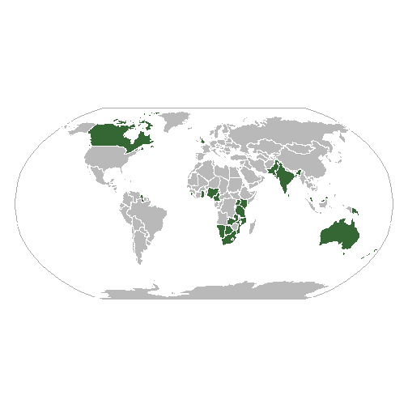

---
output:
  github_document: default
  html_document: default
---
Using CountryCodes database and sf package.
================

This vignette is an example of use of the database provided in the Github project [Country Codes and International Organizations & Groups](https://dieghernan.github.io/projects/countrycodes/) by using the `sf` package in R.

Required R packages
-------------------

``` r
library(sf)
library(jsonlite)
library(rnaturalearth)
library(dplyr)
```

Reading the data
----------------

The first step consists on reading the database provided (in this example the `json` file) and extracting one international organization. In this example we will plot the [Commonwealth of Nations](https://en.wikipedia.org/wiki/Commonwealth_of_Nations).

``` r
df = fromJSON("https://raw.githubusercontent.com/dieghernan/Country-Codes-and-International-Organizations/master/outputs/Countrycodesfull.json")
# Identify Commonwealth acronym
orgsdb = read.csv("https://raw.githubusercontent.com/dieghernan/Country-Codes-and-International-Organizations/master/outputs/CountrycodesOrgs.csv") %>% 
    distinct(org_id, org_name)
orgsdb[grep("Common", orgsdb$org_name), ]
```

    ##       org_id                                       org_name
    ## 25         C                                  Commonwealth 
    ## 26      CACM                Central American Common Market 
    ## 30   CARICOM         Caribbean Community and Common Market 
    ## 42       CIS            Commonwealth of Independent States 
    ## 43    COMESA Common Market for Eastern and Southern Africa 
    ## 115 MERCOSUR                   Southern Cone Common Market

In our case, the value to search is **C**. It is provided also a function that extract the membership from the `json` database:

``` r
ISO_memcol = function(df, orgtosearch) {
    ind = match(orgtosearch, unlist(df[1, "org_id"]))
    or = lapply(1:nrow(df), function(x) unlist(df[x, "org_member"])[ind])
    or = data.frame(matrix(unlist(or)), stringsAsFactors = F)
    names(or) = orgtosearch
    df2 = as.data.frame(cbind(df, or, stringsAsFactors = F))
    return(df2)
}
df_org = ISO_memcol(df, "C")
```

Now `df_org` has a new column, named **C**, containing the membership status of each country.

``` r
df_org %>% count(C)
```

    ## # A tibble: 2 x 2
    ##   C          n
    ##   <chr>  <int>
    ## 1 <NA>     222
    ## 2 member    53

``` r
df_org %>% filter(!is.na(C)) %>% select(ISO_3166_3, NAME.EN, C) %>% head()
```

    ##   ISO_3166_3           NAME.EN      C
    ## 1        ATG Antigua & Barbuda member
    ## 2        AUS         Australia member
    ## 3        BHS           Bahamas member
    ## 4        BGD        Bangladesh member
    ## 5        BRB          Barbados member
    ## 6        BLZ            Belize member

Replacing the data on a map.
----------------------------

In this example the `rnaturalearth` package is used for retrieving an `sf` object. The code below replaces the `data.frame` part of the `sf`object. and replacing the `dataframe`for the dedicated database.

``` r
testmap = ne_countries(50, "countries", returnclass = "sf") %>% select(ISO_3166_3 = adm0_a3) %>% 
    full_join(df_org)
```

Plotting map: Wikipedia style
-----------------------------

Now we would try to plot a map ressembling the one presented in the [Wikipedia page](https://en.wikipedia.org/wiki/Commonwealth_of_Nations) for the Commonwealth.


The map we will generate is presented under a Robinson projection and the color palette will be based in the [Wikipedia convention for Orthographic Maps](https://en.wikipedia.org/wiki/Wikipedia:WikiProject_Maps/Conventions/Orthographic_maps), since it is the one used in the example.

``` r
# Projecting the map
testmap_rob = st_transform(testmap, "+proj=robin")

# Bounding box
bbox = st_linestring(rbind(c(-180, 90), c(180, 90), c(180, -90), c(-180, -90), 
    c(-180, 90))) %>% st_segmentize(5) %>% st_cast("POLYGON") %>% st_sfc(crs = 4326) %>% 
    st_transform(crs = "+proj=robin")

# Plotting

plot.new()
plot(bbox, col = "#FFFFFF", border = "#AAAAAA", lwd = 1.5)
plot(st_geometry(testmap_rob), col = "#B9B9B9", border = "#FFFFFF", lwd = 0.1, 
    add = T)

plot(st_geometry(testmap_rob %>% filter(!is.na(C))), col = "#346733", border = "#FFFFFF", 
    lwd = 0.1, add = T)
```


