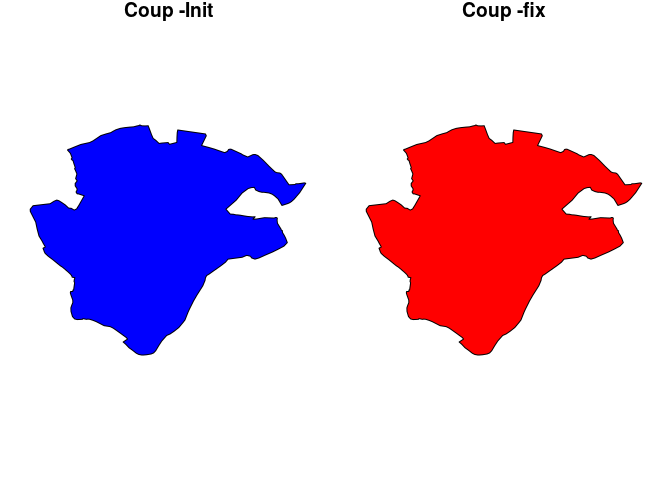
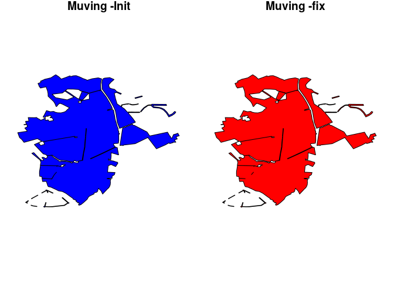
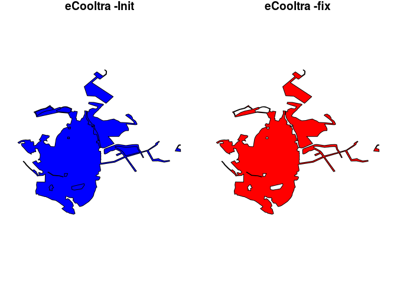
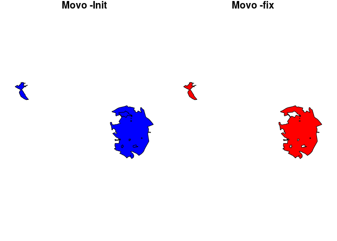
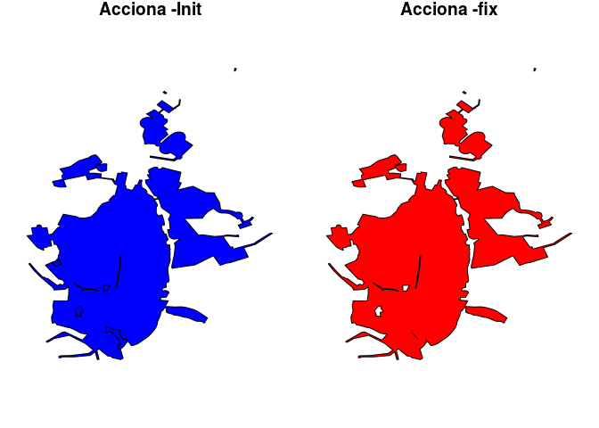
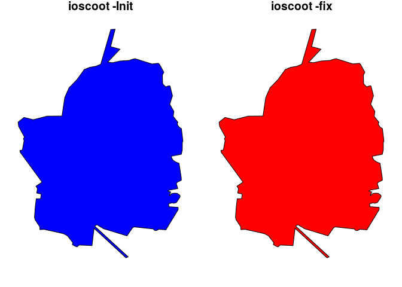

Test geometries
================

<!-- --><!-- --><!-- --><!-- --><!-- --><!-- -->

# Code used - Example

``` r
# init----
rm(list = ls())
library(sf)
library(jsonlite)
library(dplyr)

origsharing <- function(data){
  geom = lapply(1:length(data[["areas"]][["coordinates"]]), function(x) {
    st_linestring(data[["areas"]][["coordinates"]][[x]][, 1:2]) %>% st_cast("POLYGON")
  }) %>% st_sfc()
  return(geom)
}

cleansharing <- function(data) {
  geom = lapply(1:length(data[["areas"]][["coordinates"]]), function(x) {
    st_linestring(data[["areas"]][["coordinates"]][[x]][, 1:2]) %>% st_cast("POLYGON")
  }) %>% st_sfc()
  
  df = st_sf(area = st_area(geom) / 1000, geom)
  df = df %>% arrange(desc(area))
  df$a = 1
  df = df[, 3]
  for (i in 1:nrow(df)) {
    if (i == 1) {
      keep = df[i, ]
    } else {
      if (st_contains(keep, df[i, ], sparse = FALSE)) {
        keep = st_difference(keep, df[i, ])
        keep = keep[, 1]
      } else {
        geom = st_combine(rbind(keep, df[i, ]))
        keep = st_sf(st_drop_geometry(keep), geom)
        keep = st_buffer(keep, 0)
        rm(geom)
      }
    }
  }
  return(keep)
}


#Coup----
download.file("https://storage.googleapis.com/providers/a/coup-madrid.json",
              destfile = "../_data/shp/sharing/coup_madrid.json")

data=fromJSON("../_data/shp/sharing/coup_madrid.json")
init="Coup"
data_init=origsharing(data)
data_clean=cleansharing(data)
```
